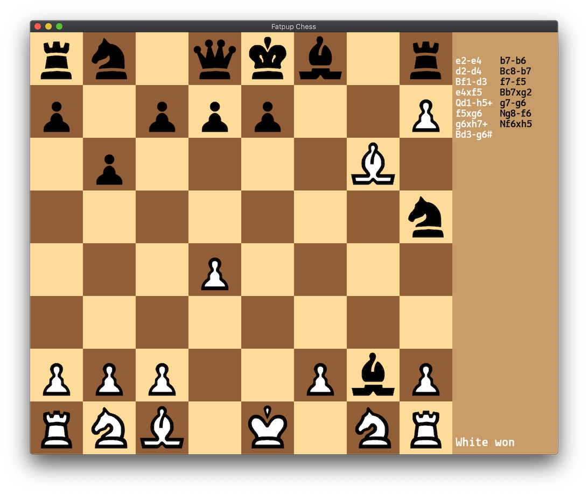
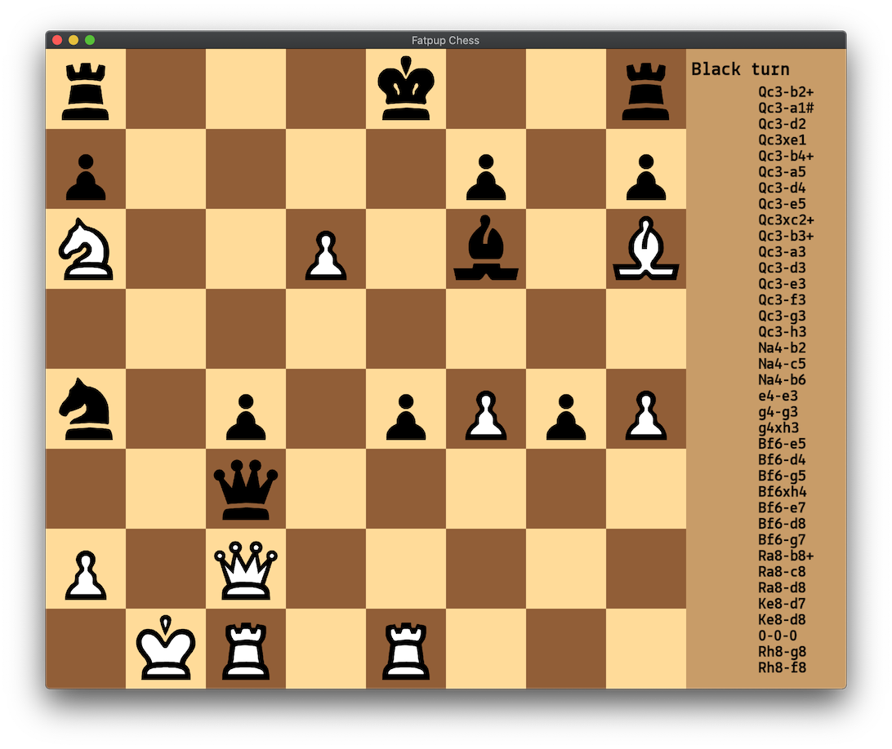

# fatpup
Super lightweight portable zero-dependency chess library written in simple C++, thoroughly test-covered. It implements an easy to use chess board and move classes you can use for you chess UI. Chess rules are very complicated if you consider all the scenarios of castling, pinned pieces and such - 9 out of 10 hobby chess projects on GitHub cannot even handle en passant and/or castling properly. Fatpup will get all the moves right and tell you if the position is check/checkmate/stalemate using next to zero CPU/RAM. 
It's not a chess engine though, i.e. it won't tell you which move is the best. Fatpup objective is something like an online chess server running on Raspberry Pi handling 1M games simultaneously.

